# 🏥 ClinicMS

<div align="center">

## Book • Manage • Care

*A multi-role clinic management platform built for doctors, receptionists, patients, and administrators.*

<br>


<br>


<br>


</div>

---

<p align="center">
  
</p>

---

# 📖 Overview

**ClinicMS** is a full-stack clinic management system built on a Laravel REST API backend with a React frontend. It brings together everything a small-to-mid-size clinic needs to run day to day: patient registration and approval, appointment scheduling, a live front-desk queue, billing and invoicing, electronic medical records, prescriptions, in-app notifications, and operational reporting — all behind role-based authentication with **Laravel Sanctum**.

The system supports **four distinct roles** — **Admin**, **Doctor**, **Receptionist**, and **Patient** — each with its own dashboard, permissions, and workflows, so every user only sees and does what their role allows.

---

# 📸 Screenshots

## 🔐 Authentication & Registration

<p align="center">
  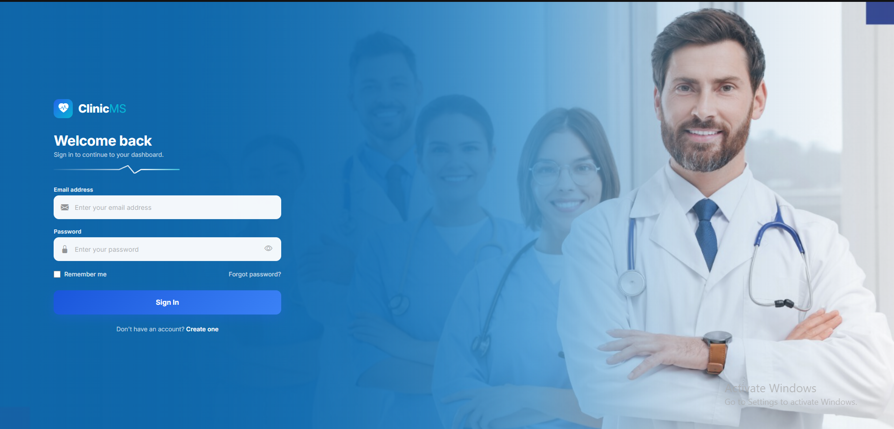
</p>

<p align="center">
  <em>ClinicMS authentication interface with role-based access.</em>
</p>

<p align="center">
  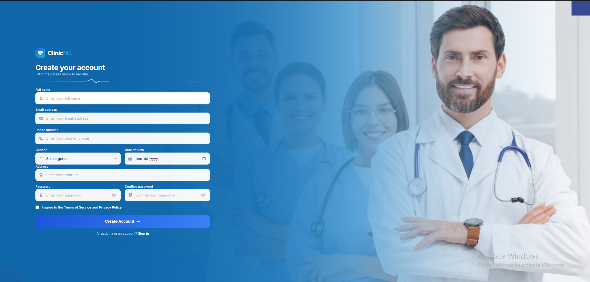
</p>

<p align="center">
  <em>Patient self-registration before receptionist approval.</em>
</p>

---

## 🧑‍💼 Receptionist

<p align="center">
  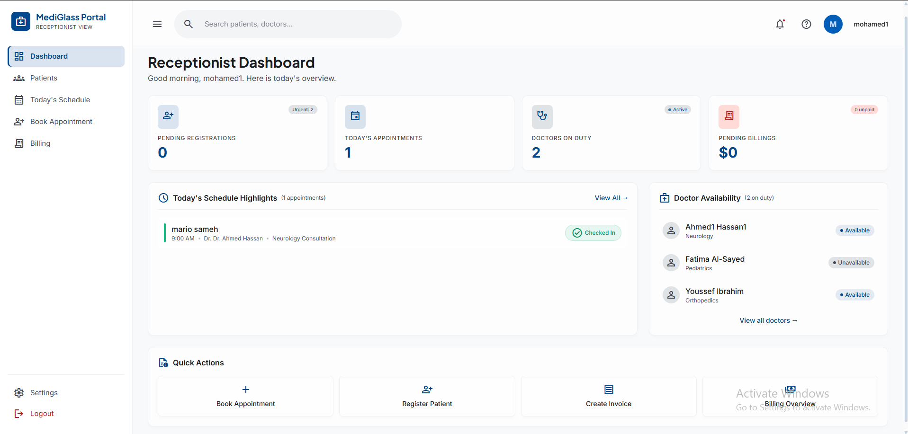
</p>

<p align="center">
  <em>Receptionist dashboard with today's appointments, patient activity, and quick actions.</em>
</p>

<p align="center">
  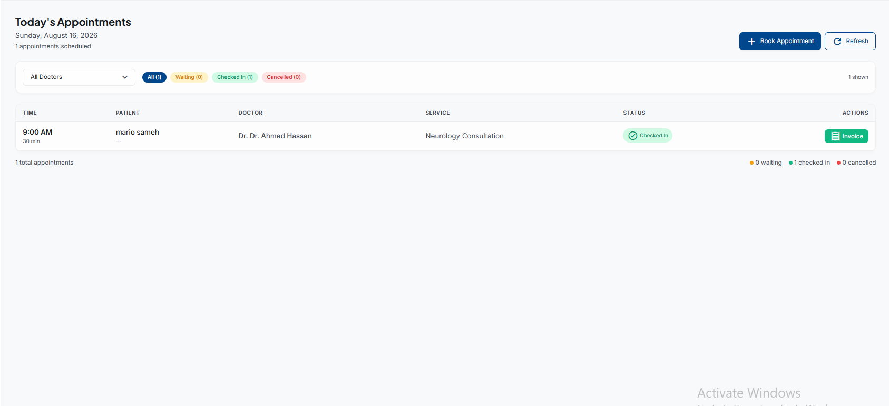
</p>

<p align="center">
  <em>Receptionist appointment management.</em>
</p>

<p align="center">
  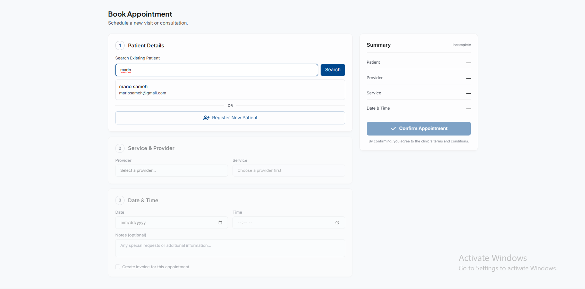
</p>

<p align="center">
  <em>Receptionist booking an appointment for a patient.</em>
</p>

<p align="center">
  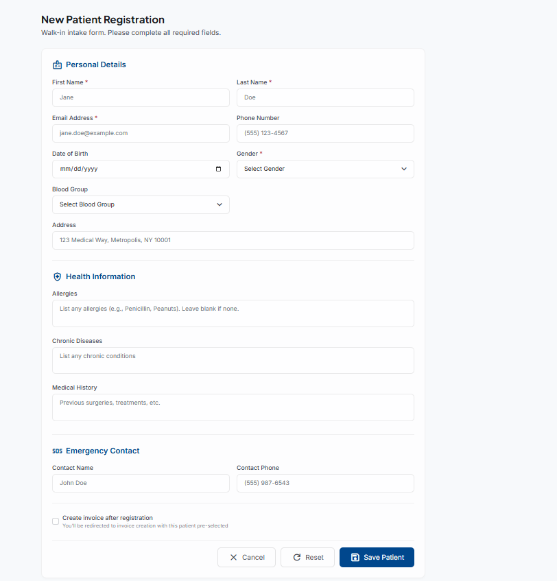
</p>

<p align="center">
  <em>Registering a walk-in patient at the clinic.</em>
</p>

<p align="center">
  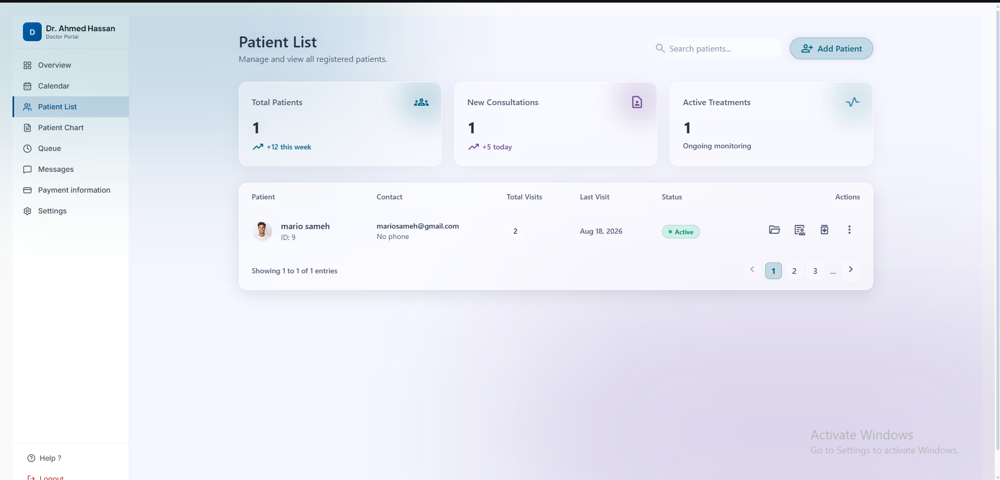
</p>

<p align="center">
  <em>Receptionist patient list and management interface.</em>
</p>

---

## 👨‍⚕️ Doctor

<p align="center">
  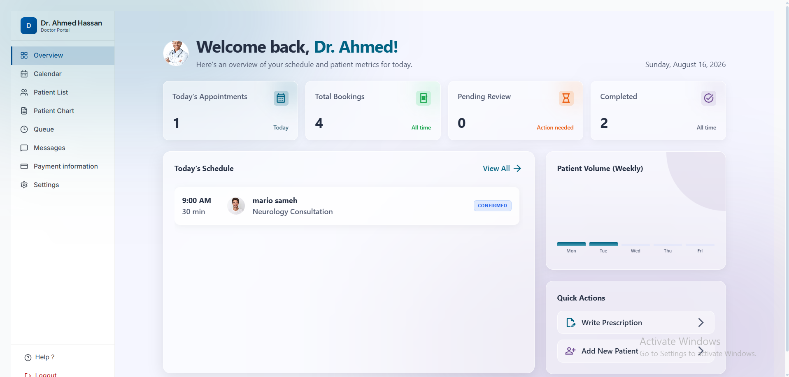
</p>

<p align="center">
  <em>Doctor portal for managing appointments, patients, and clinical activities.</em>
</p>

<p align="center">
  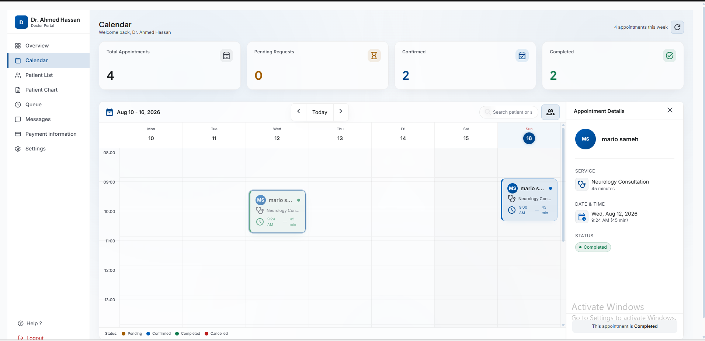
</p>

<p align="center">
  <em>Doctor calendar displaying scheduled appointments.</em>
</p>

<p align="center">
  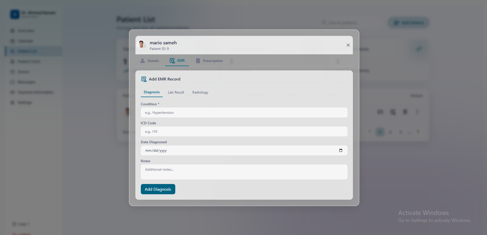
</p>

<p align="center">
  <em>Electronic medical record for managing patient clinical information.</em>
</p>

---

## 🧑‍🦱 Patient

<p align="center">
  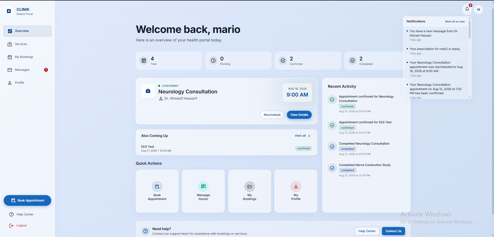
</p>

<p align="center">
  <em>Patient dashboard with appointments, medical information, and quick actions.</em>
</p>

<p align="center">
  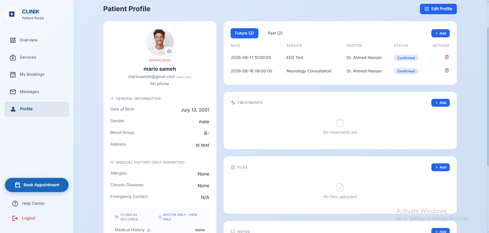
</p>

<p align="center">
  <em>Patient profile and personal information.</em>
</p>

<p align="center">
  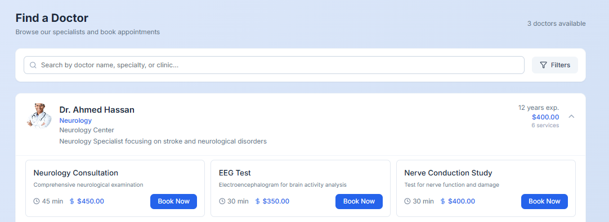
</p>

<p align="center">
  <em>Patient service and appointment booking interface.</em>
</p>

---

## 💳 Billing & Invoicing

<p align="center">
  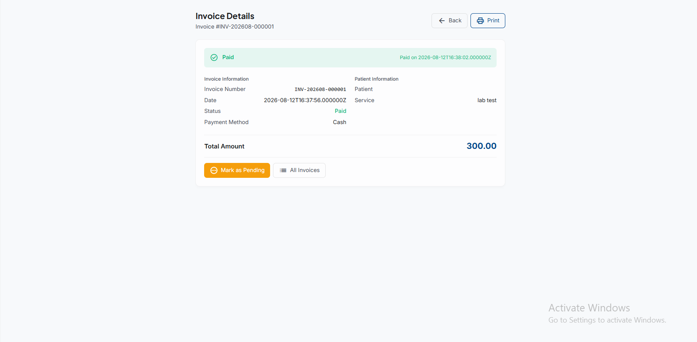
</p>

<p align="center">
  <em>Clinic invoice and payment tracking.</em>
</p>

---

## 🛠️ Administration

<p align="center">
  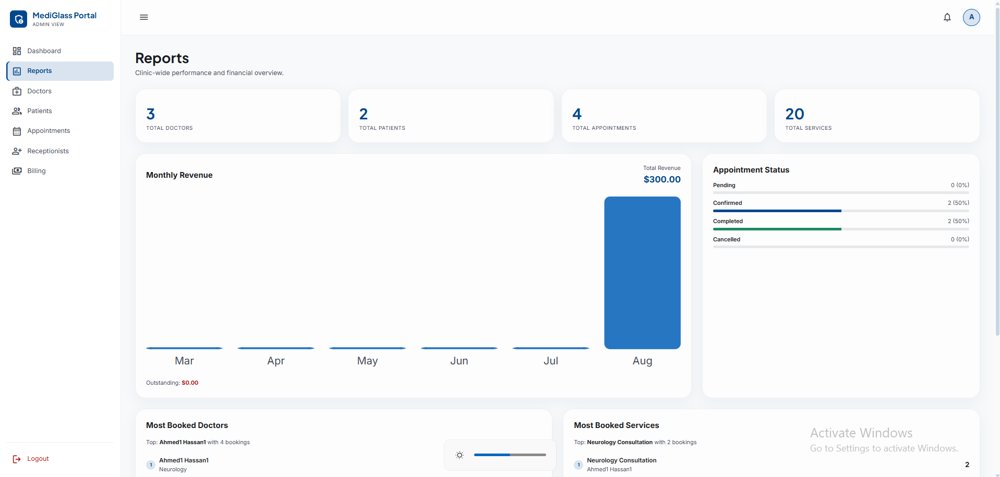
</p>

<p align="center">
  <em>Administrative reports and clinic performance overview.</em>
</p>

<p align="center">
  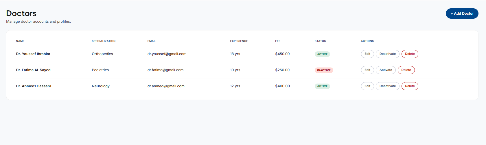
</p>

<p align="center">
  <em>Admin interface for managing doctors.</em>
</p>

<p align="center">
  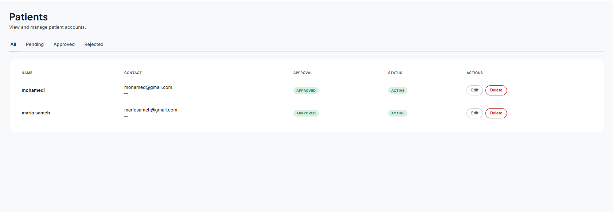
</p>

<p align="center">
  <em>Admin interface for managing patients.</em>
</p>

---

## 🖼️ System Overview

<p align="center">
  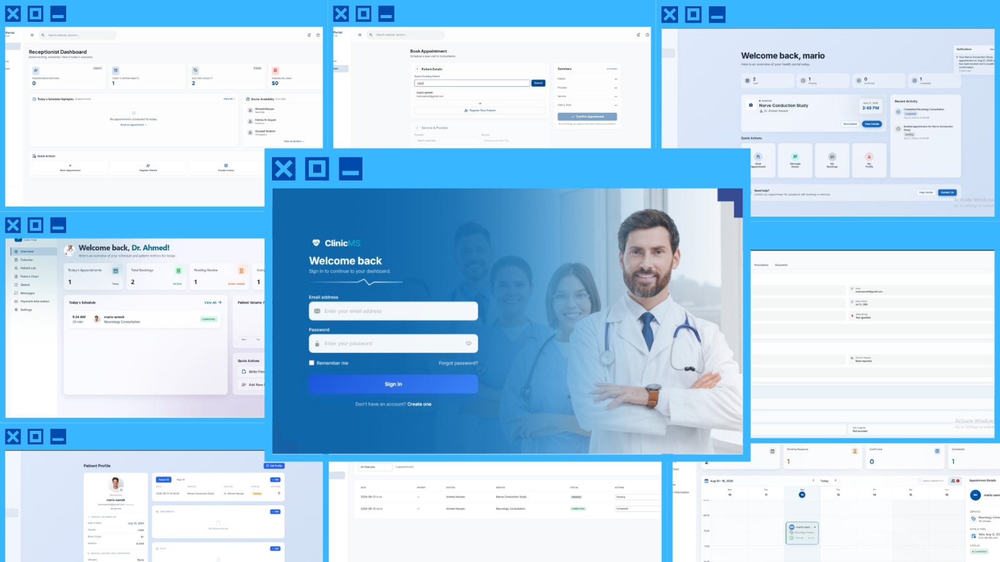
</p>

<p align="center">
  <em>ClinicMS overview showcasing the main interfaces and workflows across the four user roles.</em>
</p>


---

# 👥 Roles & Access

| Role                   | Can do                                                                                                                                                                                               |
| ---------------------- | ---------------------------------------------------------------------------------------------------------------------------------------------------------------------------------------------------- |
| 🧑‍⚕️ **Doctor**       | Manage own appointments and queue, view/manage own patients, write diagnoses/lab results/radiology results/prescriptions, message patients, view own payment status                                  |
| 🧑‍💼 **Receptionist** | Approve/reject patient registrations, register walk-ins, book/reschedule/cancel appointments, check patients in, manage billing (create invoices, mark paid), view today's schedule                  |
| 🧑‍🦱 **Patient**      | Book appointments, message doctors, view own medical records/prescriptions, view/pay invoices, receive notifications                                                                                 |
| 🛠️ **Admin**          | Manage doctors, patients, and receptionists; view all appointments; view revenue, financial reports, and outstanding payments; export patient/doctor/appointment records as HL7 FHIR-compatible JSON |

---

# ✨ Features

* 📝 Patient self-registration with a receptionist approval workflow
* 📅 Appointment booking, rescheduling, and cancellation with conflict checking
* 🪑 Live patient queue — check-in → waiting → called in → completed
* 💳 Billing and invoicing with payment tracking
* 🩺 Electronic Medical Records — diagnoses, lab results, radiology results
* 💊 Prescriptions, with automatic patient notifications
* 📎 Bidirectional document uploads (prescriptions, radiology, lab reports, insurance, and more) between doctors and patients
* 🔔 In-app notifications — bookings, approvals, cancellations, messages, prescriptions
* 💬 Doctor–patient messaging
* 📊 Admin dashboard with revenue, appointment status, and top-doctor/service reporting
* 🌐 HL7 FHIR-compatible data export (Patient, Practitioner, Appointment)

---

# 🛠️ Technology Stack

**Backend:** PHP 8.1+, Laravel 11, Laravel Sanctum (authentication), MySQL

**Frontend:** React 18, React Router

**Tools:** Composer, npm/Vite, phpMyAdmin, Git

---

# 🚀 Installation

```bash
git clone https://github.com/M718-arch/NTI_Clinic_System_G3.git
cd NTI_Clinic_System_G3
```

**Backend setup:**

```bash
composer install
cp .env.example .env
php artisan key:generate
# configure your database credentials in .env
php artisan migrate
php artisan storage:link
php artisan serve
```

**Frontend setup:**

```bash
npm install
npm run dev
```

Then open:

```text
http://localhost:8000
```

---

# 👨‍💻 Development Team

| Name                        | Role                 |
| --------------------------- | -------------------- |
| **Mario Sameh Fawzy Moans** | Full Stack Developer |
| **Mohamed Sameh**           | Full Stack Developer |
| **Shahd Ashraf**            | Full Stack Developer |
| **Shahd Keshk**             | Full Stack Developer |
| **Nour Zeidan**             | Full Stack Developer |

---

# 📜 License

Educational project.

<div align="center">

### ⭐ If you like this project, give it a star!

Made with 🩺 by **Mario Sameh, Mohamed Sameh, Shahd Ashraf, Shahd Keshk & Nour Zeidan**

</div>
